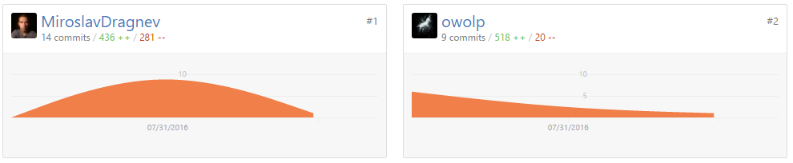

# Snake Game

**Team:** Manhattan

**Category:** Canvas HTML5 and Javascript

**Date:** August 2016

### Team Manhattan Members

| Name					 | TA Profile			| GitHub													|
| :-------------------- | :-------------------- | :-------------------------------------------------------- |
| Мирослав Драгнев		| DragonClaw			| [MiroslavDragnev](https://github.com/MiroslavDragnev)		|
| Антоан Ленгерджиев	| Antoan_Lengerdjiev	| [antoanLengerdjiev](https://github.com/antoanLengerdjiev)	|
| Иво Демерджиев		| IvoDemerdjiev			| [IvoDemerdjiev](https://github.com/IvoDemerdjiev)			|
| Емил Иванов			| starter_e				| [startere](https://github.com/startere)					|
| Златин Костов			| owolp					| [owolp](https://github.com/owolp)							|
| Явор Пармаков			| yavpa					| [yavpa](https://github.com/yavpa)							|
| Емилия Банчева		| emiliq_95				| [emiBB](https://github.com/emiBB)							|


### GitHub Contributors



---

#### This is a simple classic 8 bit snake game created using the canvases of HTML5 and javascript

The important thing to know before start is that our snake is formed by a chain of elements (squares).

## Istructions

1. Create the canvas element in our html.
1. Draw the body of the snake and the food using canvases.
1. Create the structure of the snake and of the food.
1. Create a _checkIfSnakeOverflows_ function to detect if the snake.
1. Create a _checkIfSnakeSteppedOnFood_ function to detect if the snake has stepped on a food and add points to the final score.
1. Create a _checkIfSnakeCrashedIntoItself_ function to detect if the snake has crashed into itself and the game ends.
1. Create the main function which has to run everything we need to play.
1. Use the _pressingKey_ event to move the snake using the keyboard.

## The Snake

### How draw the snake with canvas

```js
```

### The structure of the snake

```js
```

### The movement of the snake

```js
```

